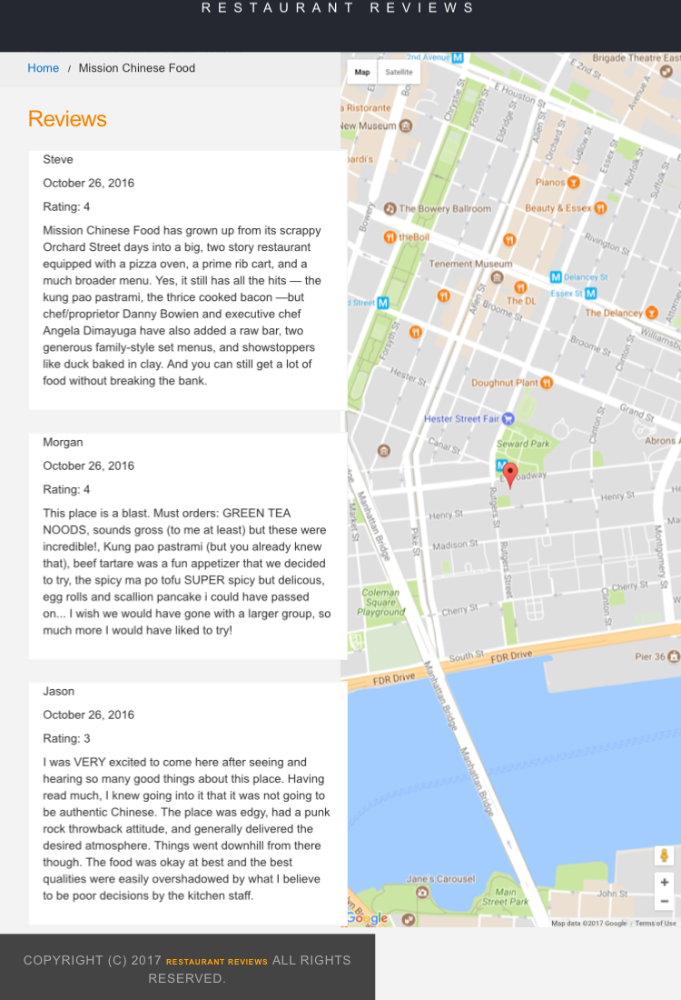
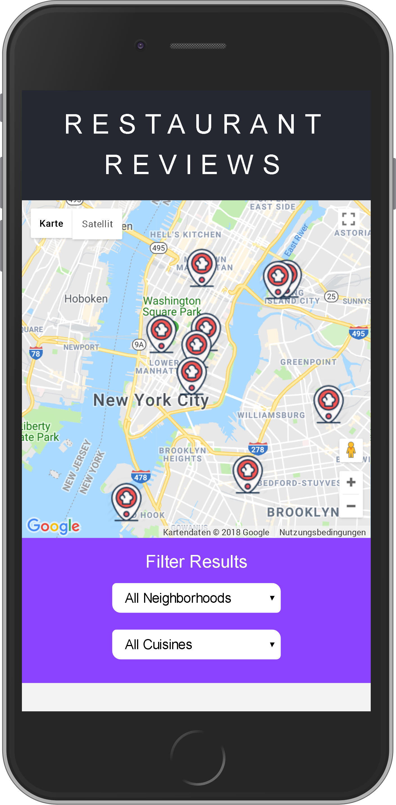
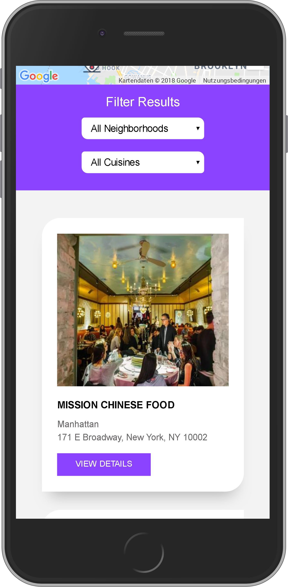

# Frontend Web Developer Nanodegree

## Project Overview

For the **Restaurant Reviews** projects, you will incrementally convert a static webpage to a mobile-ready web application. In **Stage One**, you will take a static design that lacks accessibility and convert the design to be responsive on different sized displays and accessible for screen reader use. You will also add a service worker to begin the process of creating a seamless offline experience for your users.

### Specification

You have been provided the code for a restaurant reviews website. The code has a lot of issues. It’s barely usable on a desktop browser, much less a mobile device. It also doesn’t include any standard accessibility features, and it doesn’t work offline at all. Your job is to update the code to resolve these issues while still maintaining the included functionality.

### Requirements

Make the provided site fully responsive. All of the page elements should be usable and visible in any viewport, including desktop, tablet, and mobile displays. Images shouldn't overlap, and page elements should wrap when the viewport is too small to display them side by side.

You will convert a site that looks like this:

## 

into a site that looks like this:

## 

---

**Make the site accessible**. Using what you've learned about web accessibility, ensure that alt attributes are present and descriptive for images. Add screen-reader-only attributes when appropriate to add useful supplementary text. Use semantic markup where possible, and aria attributes when semantic markup is not feasible.

**Cache the static site for offline use**. Using Cache API and a ServiceWorker, cache the data for the website so that any page (including images) that has been visited is accessible offline.

## Installation

To run this app you will have to have [**Node.js**](https://nodejs.org/en/), [**npm**](https://www.npmjs.com/get-npm) and [**bower**](https://bower.io/) installed in your machine.

Please follow below instructions to run the project in your machine:

1. Clone repository to your local disk
2. Open terminal and navigate to the project folder
3. Run `npm install` command from terminal to install all npm dependencies
4. Run `bower install` command from terminal to install all bower dependencies
5. Run `npm start` command to compile project and run a **dev version** of the application with optimised images. Alternatively, you can run `npm run serve` command to compile project and run a **distribution version** of the application with minified files and optimised images.
